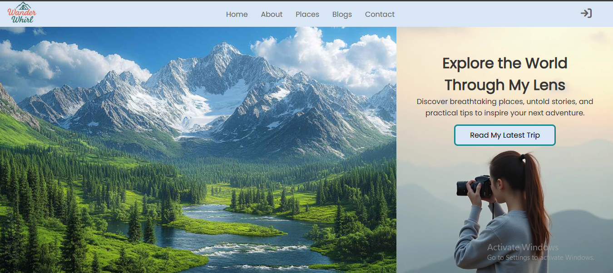
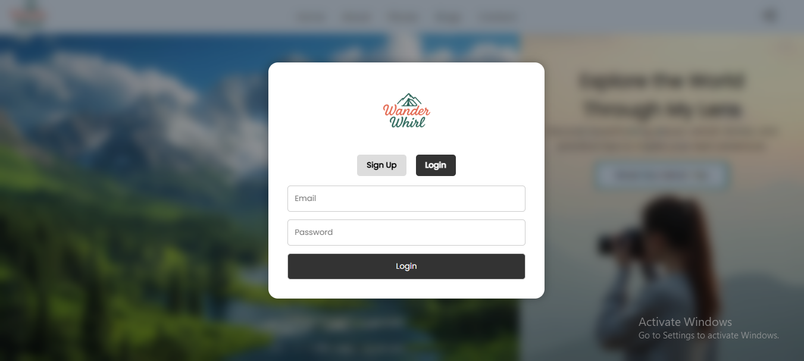
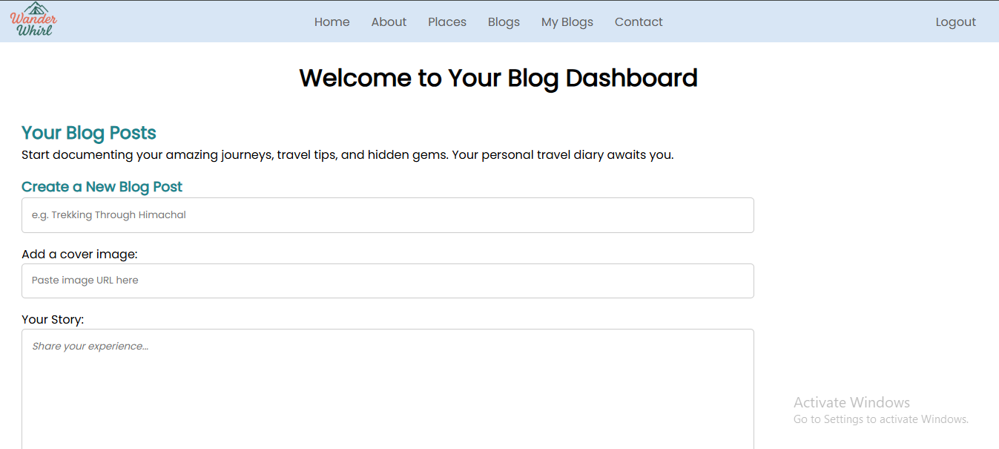

# 📝 WanderWhirl - Blog Platform

**WanderWhirl** is a personal blogging platform built entirely using **HTML**, **CSS**, and **Vanilla JavaScript**. It allows users to **sign up**, **log in**, and **create, edit, or delete blogs** – all within the browser using `localStorage`.

---

## 📸 Screenshots

| Start Screen | Places | Blogs View | SignUp Page | Blog Creation Page | 
|--------------|-------------|-----------|
|  |  |  |  |  |

---

## 🚀 Features

- 🔐 User Authentication (Signup/Login modal)
- 📝 Create and publish personal blog posts
- ✏️ Edit or delete blogs
- 📦 Data stored using `localStorage` (no backend)
- 💡 Modal-based UI with smooth toggle animations
- 💻 Fully responsive and built with clean UI design

---

## 🛠️ Tech Stack

| HTML | CSS | JavaScript |
|------|-----|-------------|

All UI components and DOM manipulation are built purely with vanilla JavaScript – no frameworks or libraries involved.

---

## 🧩 Folder Structure

```
WanderWhirl/
│
├── index.html # Landing page with login/signup modal
├── blogs.html # Main blog list page
├── myblogs.html # Blog creation page (form)
├── assets/
│ ├── logo.png
│ ├── login-icon.png
│ └── ... (other images)
├── style.css # All styling
├── script.js # All DOM and logic
└── README.md # This file
```

## 🔧 How It Works

1. **Login/Signup Modal**:
   - Triggered by clicking the login icon.
   - Smooth toggle between signup and login forms.

2. **Blog Creation**:
   - Available via `myblogs.html` after login.
   - Stores blog data in `localStorage`.

3. **Blog Display**:
   - `blogs.html` dynamically renders blog cards from localStorage.
   - Edit and Delete buttons available on each blog post.

---

## 🌐 Live Preview

> 📍 [View Live on GitHub Pages](https://techieshruti.github.io/Brainwave_Matrix_Intern_Task_2/)

---

## 🧠 Lessons Learned

- DOM manipulation and modal UI design in JavaScript
- Working with `localStorage` for data persistence
- Reusing components like navbar and modals across pages
- Debugging and resolving GitHub Pages deployment issues

---

## 📬 Connect with Me

[](https://www.linkedin.com/in/shruti-chandra-656578174/)
[](mailto:shrutichandra721@gmail.com)

---

## 🙌 Author

**Shruti Chandra**  
Frontend Enthusiast | Passionate about learning through building.

> 🧡 *“Code is like humor. When you have to explain it, it’s bad.” – Cory House*

